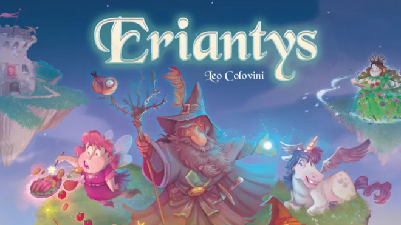

# Prova Finale Ingegneria del Software 2022

La prova finale di ingegneria del software consiste nell'implementazione 
di un applicazione distribuita del gioco da tavolo [Eriantys](https://www.craniocreations.it/prodotto/eriantys/), 
attraverso il pattern Model View Controller (MVC). 
## Gruppo AM20

- ###   10656496    Simone Airaghi ([@SimoneAiraghi](https://github.com/SimoneAiraghi))<br>simone1.airaghi@mail.polimi.it
- ###   10706985    Matteo Boido ([@MatteoBoido](https://github.com/MatteoBoido))<br>matteo.boido@mail.polimi.it
- ###   10673045    Lorenzo Bossi ([@LorenzoBossi](https://github.com/LorenzoBossi))<br>lorenzo1.bossi@mail.polimi.it

## Esecuzione
Questo progetto richiede java 17 o superiore per essere eseguito.
###Jar
Abbiamo creato un unico jar per client e server, scaricabile qui: [Jar](https://github.com/LorenzoBossi/..).

###Client
Di default l'esecuzione del jar fa partire un client (GUI).
Può essere eseguito attraverso il seguente comando:
```
java -jar AM20-Eriantys.jar
```
Inoltre è possibile utilizzare il client da linea di comando (CLI) aggiungendo 
il parametro --cli, oppure la versione ridotta -c.
```
java -jar AM20-Eriantys.jar --cli
```
```
java -jar AM20-Eriantys.jar -c
```
###Server
Per utilizzare il jar come server è necessario aggiungere 
il parametro --server, oppure -s.
```
java -jar AM20-Eriantys.jar --server
```
```
java -jar AM20-Eriantys.jar -s
```
Di default il server partirà sulla porta 26000.
Se si vuole utilizzare una porta differente basta aggiungere 
un ulteriore parametro (--port o -p ), seguito dal numero di porta scelto.
```
java -jar AM20-Eriantys.jar --server --port 23456
```
```
java -jar AM20-Eriantys.jar --server -p 23456
```


## Advancements

| Functionality    |                       State                        |
|:-----------------|:--------------------------------------------------:|
| Basic rules      | 🟢 |
| Complete rules   | 🟢 |
| Socket           | 🟢 |
| GUI              | 🟢 |
| CLI              | 🟢 |
| 12 Characters    | 🟢 |
| 4 Players games  | 🔴  |
| Multiple games   | 🟢 |
| Persistence      | 🔴  |
| Resilience       | 🔴  |

## Test coverage
|Package|Lines|Methods|Classes|
|:---------------:|:-----------:|:-----------:|:-----------:|
|model|97%|95%|95%|
|controller|100%|100%|100%|
|client|2%|4%|10%|
|network|8%|7%|22%|
|utils|21%|40%|50%|